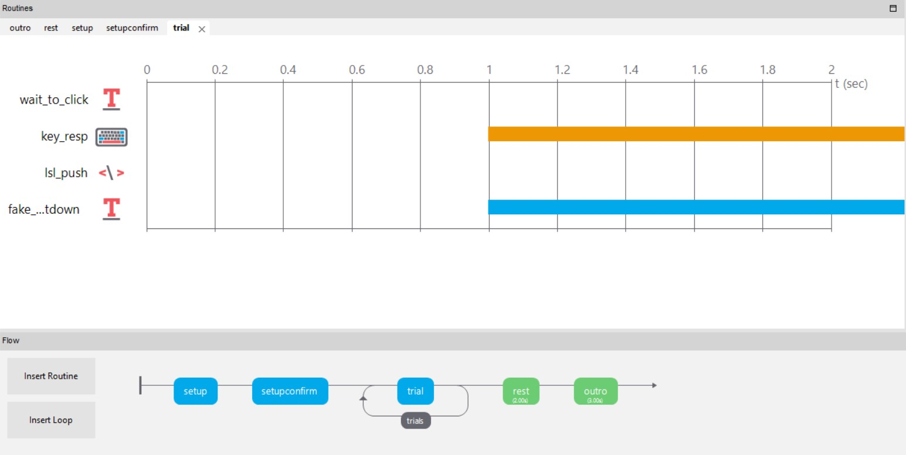

# Psychopy_LSL
This repository contains a Psychopy project (tested with v2023.1.3) that utilizes the LabStreamingLayer (LSL) for data streaming. The project includes a setup phase to initiate the LSL outlet, a loop named "trials" with the routine named "trial," a rest screen, and an outro. No additional Psychopy package needed.

## Project Overview
Psychopy (Tested with v2023.1.3)



The main goal of this Psychopy project is to establish LSL streaming for the experiment. The setup phase includes the following code snippet, which is inserted in the "begin routine" phase:

```
from pylsl import StreamInfo, StreamOutlet
info = StreamInfo(name='psychopy_markers', type='Markers', channel_count=1,
                  channel_format='int32', source_id='uniqueid12345')
# Initialize the stream.
outlet = StreamOutlet(info)
```

In each "trial" routine, the LSL streaming sends out the number of iterations in the loop using the following code at the "begin routine" phase:

```
outlet.push_sample(x=[trials.thisN])
```

To enhance user experience and provide better-paced input, a timer text prompts the user to press the space button during the "trial" routine.

In the "rest" routine, the LSL streaming sends out another marker using the following code:

```
outlet.push_sample(x=[200])
```

Lastly, the project concludes with a typical outro.

## Recording the Signal Using LabRecorder

Install Lab Recorder: Download and install the Lab Recorder application from the LabStreamingLayer website (https://github.com/labstreaminglayer/App-LabRecorder).

Once the Psychopy project is running, start recording in LabRecorder. The ```setupconfigure``` routine is dedicated to starting LabRecorder to capture the signal and will not proceed to the test until the user presses ```a```. The data will be saved in an XDF file, which you can later analyze with the XDF Reader code or any other compatible tool.


## XDF Reader
This repository also includes a Python code snippet that reads and prints XDF data in the console. The code utilizes the [pyxdf](https://pypi.org/project/pyxdf/) package, which is required to run the XDF reader.

To install the required package, use the following command:

```
pip install pyxdf
```

Sample data is read and printed in the console, showing the timestamp and corresponding markers:

```
Type: Timestamp: 2611.099362, Marker: 0
Type: Timestamp: 2612.788768, Marker: 1
Type: Timestamp: 2614.137672, Marker: 2
Type: Timestamp: 2615.750896, Marker: 3
Type: Timestamp: 2617.308433, Marker: 4
Type: Timestamp: 2618.754789, Marker: 200
```
